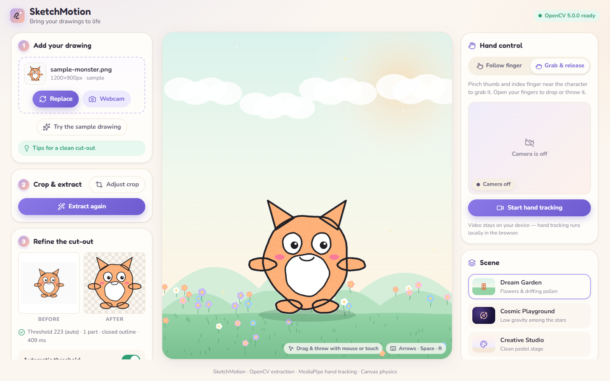
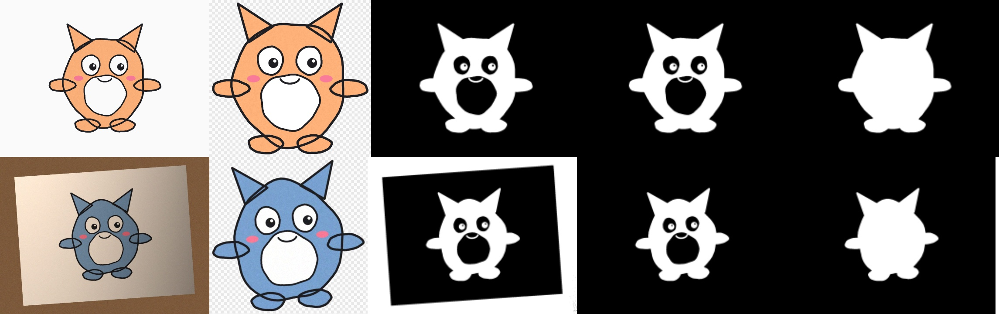

# SketchMotion — Bring Your Drawings to Life

Draw a character on white paper, take a photo (or capture it with your webcam), and watch it appear in a small interactive world. Move it with your fingertip, pinch to grab it, let go to make it bounce.

**draw → capture → extract → animate → interact**



| Part | How it works |
|---|---|
| Drawing extraction | Classical **OpenCV + NumPy** pipeline served by **FastAPI** (no ML, no paid APIs) |
| Hand tracking | **MediaPipe Hand Landmarker**, running locally in the browser (video never leaves the device) |
| Gestures | Pinch detection normalised by hand size, with hysteresis, One Euro smoothing, mirrored mapping and a grace period |
| Animation | **HTML Canvas** with fixed-timestep physics: gravity, bounces, wall collisions, squash and stretch, sparkle trails |
| UI | **React + Vite**, plain modular CSS, keyboard accessible, responsive down to phone width |

---

## 1. Quick start (Windows)

**You need:** Python 3.10–3.12 ([python.org](https://www.python.org/downloads/), tick "Add to PATH"), Node.js 18+ ([nodejs.org](https://nodejs.org/)), and Chrome or Edge.

### Option A: one-click scripts

```bat
setup.bat            :: once: creates the venv, installs Python + npm packages, downloads the hand model
start-backend.bat    :: terminal 1 → http://127.0.0.1:8000
start-frontend.bat   :: terminal 2 → http://localhost:5173
```

Open **http://localhost:5173** and click **Try the sample drawing**.

### Option B: manual commands

```bat
:: Terminal 1: backend
cd backend
py -3 -m venv .venv
.venv\Scripts\activate
python -m pip install -r requirements.txt
python -m uvicorn app.main:app --reload --port 8000

:: Terminal 2: frontend
cd frontend
npm install
npm run dev
```

> PowerShell: if `activate` is blocked, run `Set-ExecutionPolicy -Scope CurrentUser RemoteSigned` once, or use `.venv\Scripts\activate.bat` from `cmd`.

### macOS / Linux

```bash
cd backend && python3 -m venv .venv && source .venv/bin/activate
pip install -r requirements.txt && uvicorn app.main:app --reload --port 8000
# second terminal
cd frontend && npm install && npm run dev
```

### Single-server mode (optional)

Run `npm run build` in `frontend/`. FastAPI then serves `frontend/dist` itself, so only the backend needs to run: open http://127.0.0.1:8000.

### Offline use

`npm install` runs `scripts/setup-mediapipe.mjs`. It copies the MediaPipe WASM runtime into `public/mediapipe/wasm` and downloads `hand_landmarker.task` (7.8 MB) into `public/models`. After that, hand tracking works without internet. If the download failed, the app falls back to the official CDN automatically. Re-run it with `npm run setup:mediapipe`.

---

## 2. Using SketchMotion

1. **Add your drawing.** Upload a PNG/JPEG (drag and drop works), take a still with **Webcam** (there's an optional 3-second timer), or use the sample.
2. **Crop & extract.** Drag the crop frame (or use the arrow keys; Shift + arrows resizes), then click **Extract character**.
3. **Refine.** Compare *Before* and *After* (the result sits on a checkerboard). Adjust the **ink threshold** and **gap closing**, drop stray doodles with **Main part only**, fix details with **Fix mask** (restore/erase brush with undo), and **Download PNG**. Open **See the computer-vision steps** to see each pipeline stage.
4. **Play.** Choose a scene and a mode, then click **Start hand tracking**.

### Controls

| Input | Action |
|---|---|
| **Follow finger** mode | The character glides after your index fingertip |
| **Grab & release** mode | Pinch (thumb + index) near the character to grab it; open your fingers to drop or throw it |
| Mouse / touch | Drag the character and fling it. Always available, even with the camera off or blocked |
| `←` `→` / `↓` | Nudge the character (focus the scene first) |
| `↑` / `Space` | Jump |
| `R` | Recenter |
| Right panel | Size, rotation, gravity, sparkle trails, Pause/Resume, Recenter, Reset |

**Status indicators:** *Camera off*, *Starting camera & model…*, *Looking for your hand*, *Ready*, *Grabbed!*, *Hand lost — holding…* (the grace period), and *Camera unavailable*.

**Scenes**
- **Dream Garden:** greenery, flowers, drifting pollen.
- **Cosmic Playground:** stars, a ringed planet, shooting stars, and low gravity (0.45 g).
- **Creative Studio:** a clean pastel stage with dot-grid paper and slow confetti.

### Tips for a clean cut-out
One character per page · white paper · dark, **closed** outline · even light without harsh shadows · leave some paper around the character.

---

## 3. Architecture

```
┌──────────────────────── Browser (React + Vite) ────────────────────────┐
│ capture/      upload · drag & drop · webcam still · crop · validation  │
│ extraction/   API client · abortable requests · result UI · mask brush │──── one still PNG ───▶ FastAPI
│ tracking/     HandTracker (camera + MediaPipe loop) · useHandTracking  │                         │
│ gestures/     GestureInterpreter (pinch, smoothing, grace) · OneEuro   │                 app/extraction.py
│ scene/        SceneEngine (RAF loop, DPR, input) · physics · scenes    │                 (OpenCV + NumPy)
│ state/        AppState (useReducer context) — coarse UI state only     │
└────────────────────────────────────────────────────────────────────────┘
   webcam frames ─▶ MediaPipe (local WASM/WebGL) ─▶ landmarks ─▶ gestures ─▶ engine.setHand()
```

**Design decisions**
- **Only the captured or uploaded still goes to the server.** Continuous webcam processing stays in the browser. The image is cropped and downscaled to at most 1600 px client-side before upload.
- **Per-frame data bypasses React.** Landmarks flow `HandTracker → GestureInterpreter → SceneEngine` through refs. React re-renders only when the coarse status changes, such as "Ready" → "Grabbed".
- **No overlapping work:**
  - Extraction requests are abortable; a new request cancels the previous one and stale responses are ignored. Slider changes are debounced, so the e2e test sees 1 request for 4 slider changes.
  - Inference runs once per *new* video frame (`requestVideoFrameCallback`). `detectForVideo` is synchronous, so calls cannot overlap.
  - Each loop callback carries a generation id, so a cancelled loop can never revive.
  - A watchdog falls back to `requestAnimationFrame` if frame callbacks stall.
- **Resources are released:**
  - Stopping hand tracking stops all camera tracks and clears `srcObject`. So do closing the capture dialog, unmounting, and `pagehide`.
  - `SceneEngine.destroy()` cancels the RAF loop and disconnects the `ResizeObserver`.
- **Web Worker decision:** inference stays on the main thread with the GPU delegate. Measured steady-state cost is about 20–30 ms per frame even under headless Chrome's software WebGL. Running MediaPipe Tasks inside a module worker is fragile in Vite dev mode. As a safeguard, if GPU inference averages over 60 ms after warm-up (a sign of software-emulated WebGL), the tracker switches itself to the CPU (XNNPACK) delegate and remembers that choice. Moving inference to a worker with `OffscreenCanvas` is listed under future work.

### Project structure

```
SketchMotion/
├─ backend/
│  ├─ app/main.py           FastAPI: /api/health, /api/extract, optional static frontend
│  ├─ app/extraction.py     the OpenCV pipeline
│  ├─ app/synthetic.py      procedural "hand-drawn" characters + photo degradations (samples & tests)
│  ├─ tools/make_samples.py regenerates the bundled sample drawings
│  ├─ tests/                pytest: pipeline behaviour + HTTP contract (21 tests)
│  └─ requirements.txt
├─ frontend/
│  ├─ public/samples/       sample-monster.png (clean) · sample-monster-photo.jpg (shadow, table, colour cast)
│  ├─ scripts/setup-mediapipe.mjs
│  └─ src/
│     ├─ capture/   CapturePanel · WebcamCapture · CropEditor · imageUtils
│     ├─ extraction/ ExtractionPanel · MaskEditor · extractApi · useExtraction
│     ├─ tracking/  handTracker · useHandTracking · drawLandmarks
│     ├─ gestures/  gestureInterpreter (+ tests) · oneEuroFilter
│     ├─ scene/     SceneEngine · physics (+ tests) · backgrounds · particles · SceneCanvas
│     ├─ controls/  HandControlPanel · ScenePicker · CharacterControls
│     ├─ state/     AppState
│     └─ ui/        primitives · Header
├─ e2e/                     headless-Chrome end-to-end suite (36 checks)
├─ docs/                    screenshots
└─ setup.bat · start-backend.bat · start-frontend.bat
```

---

## 4. Computer-vision pipeline (`backend/app/extraction.py`)


*Left to right: input · transparent result · threshold + colour mask · denoised and closed mask · filled contours.*

| # | Stage | Technique | Why |
|---|---|---|---|
| 1 | Decode | `cv2.imdecode`. JPEG uses `IMREAD_COLOR` (honours EXIF); PNG alpha is composited over white; images are capped at 1600 px with `INTER_AREA` | Bounded, predictable cost |
| 2 | **Paper illumination model** | Otsu on a 160 px thumbnail marks bright, unsaturated pixels as paper. A 2nd-order 2-D polynomial is fitted **per channel** by least squares, with 3 robust refits that drop pixels more than 3σ below the surface | Models shadows, vignetting and colour cast. Unlike a large morphological "background" filter, a polynomial fitted only to paper cannot absorb big coloured fills |
| 3 | Normalisation | `pixel / surface × 255` | Paper becomes ≈255 everywhere, so one threshold works across the whole photo. The same correction whitens the colours ("Clean paper colours") |
| 4 | **Ink mask** | Grayscale threshold on the normalised image. **Auto mode** derives it from the measured paper noise (MAD): `255 − max(7σ, 32)`, clamped to 130–223. **Manual mode** uses the slider. The result is OR-ed with an HSV **saturation mask** | Keeps light coloured strokes and fills that a gray-only threshold would lose |
| 5 | Noise filtering | Median blur → morphological **opening** (elliptical kernel scaled with resolution) → removal of connected components under 0.012 % of the image | Removes paper grain, JPEG noise and specks |
| 6 | Border rejection | Drops components with long contact with the frame edge (more than 6 % of its perimeter) or touching 3+ sides | Removes the table, the paper edge and edge shadows, while a tightly cropped character touching one edge survives |
| 7 | Gap bridging | Morphological **closing** at the chosen level (0–3); automatically escalates one level if the outline looks open | Closes small breaks so the fill can work |
| 8 | **Contour selection + fill** | `findContours(RETR_EXTERNAL)`, then the largest contour plus parts at least 2 % its size that lie within its bounding box +35 %. The **external contours are filled** | **Enclosed white areas (eyes, belly) stay opaque** because only the outside paper is removed. White pixels are never deleted indiscriminately |
| 9 | Alpha | 1 px dilation + Gaussian feather → soft anti-aliased alpha; crop with padding; BGRA PNG | Clean edges on any background |

**Quality checks instead of misleading output.** Each failure returns HTTP 422 with a code, an explanation and concrete tips:
- `too_dark`: paper level below 70.
- `background_not_detected`: more than 60 % ink, or the character covers more than 92 % of the frame.
- `no_drawing_found`
- `drawing_too_small`
- `invalid_image`, `unsupported_type` (415), `file_too_large` (413).

Soft problems become warnings shown in the UI: an open outline, auto-bridged gaps, ignored edge regions, merged parts. The **closed-outline test** compares filled area with stroke area ("fill gain") and contour solidity.

**API.** `POST /api/extract` (multipart) takes these fields:
- `file`
- `threshold` (1–254, omit for auto)
- `gap_close` (0–3)
- `keep_largest_only`
- `clean_colors`
- `include_steps`

The response contains `sprite` (RGBA PNG), `rgb` + `mask` (used by the mask brush), `bbox`, `stats`, `warnings`, `steps[]` thumbnails and `elapsed_ms`. Interactive docs are at http://127.0.0.1:8000/docs.

---

## 5. Hand tracking & gesture interpretation

`frontend/src/gestures/gestureInterpreter.js` is pure logic and unit-tested.

- **Landmarks:** MediaPipe returns 21 normalised points per hand. The app uses the index tip (8), thumb tip (4), wrist (0) and the knuckles (5, 9, 17).
- **Scale-invariant pinch:** `ratio = |thumb_tip − index_tip| / hand_size`, where `hand_size = max(|wrist − middle_MCP|, 1.25·|index_MCP − pinky_MCP|)`. This holds when the hand rotates and at any distance from the camera. x is multiplied by the camera aspect ratio, so distances aren't distorted in a 4:3 or 16:9 frame.
- **Hysteresis:** a pinch starts below **0.30** and ends above **0.45**, after a light EMA. Measured on real MediaPipe output: pointing hand ≈ 1.07, fist/pinch ≈ 0.16–0.25.
- **Smoothing:** a **One Euro filter** per axis. It smooths heavily when the hand is still (no jitter) and lightly when it moves fast (low lag). It is time-based, so it doesn't depend on frame rate.
- **Coordinate mapping:** `x' = 1 − x` matches the mirrored selfie preview (the video and landmark overlay are mirrored together with CSS). The central 76 % of the camera frame (12 % margin) maps to the full canvas, so the edges are reachable without your hand leaving the frame. The result is converted to CSS pixels at any canvas size or DPR.
- **Grace period:** if the hand disappears for 350 ms or less, the last pose is kept, so a held character isn't dropped. After that, `pinchend` (release) and `lost` fire.
- **Grabbing** uses a forgiving ellipse (+36 px) around the sprite, because hands are imprecise. Mouse and touch hits use the sprite's **real alpha channel**, so clicking a transparent area doesn't grab anything.

## 6. Physics & animation (`frontend/src/scene/physics.js`)

- **Fixed timestep:** 1/120 s with an accumulator. Frames are clamped to 0.1 s, so the motion is frame-rate independent: 30 fps and 144 fps give the same trajectory to within 0.5 px (tested).
- **Forces:** semi-implicit Euler, gravity 2200 px/s² × the scene's gravity scale, air drag, floor friction, restitution 0.52 (floor) and 0.6 (walls), and a rest threshold so bouncing actually stops.
- **Follow and hold** use a **critically damped spring** toward the target: smooth with no overshoot, and it keeps a real velocity, so releasing *throws* the character.
- **Squash and stretch:** impact speed drives a damped spring. Rendering pivots at the feet, so the character lands *on* the floor. There's a slight vertical stretch while airborne, plus idle "breathing" while resting.
- **High-DPI:** the backing store is `css px × devicePixelRatio` (capped at 2.5). A `ResizeObserver` plus `window.resize` (for DPR changes) rebuild the cached static background, and the character keeps its relative position.

---

## 7. Verification — what was actually tested

Tested on Windows 11, Python 3.11.9, Node 24.16, Chrome (headless).

| Suite | Command | Result |
|---|---|---|
| Backend pipeline + API | `cd backend && .venv\Scripts\python -m pytest -q` | **21 passed** |
| Gesture + physics unit tests | `cd frontend && npm test` | **17 passed** |
| End-to-end, real browser | see below | **36/36 passed** on 3 consecutive runs |

**Extraction** (pytest, synthetic drawings from `app/synthetic.py`):
- On a clean scan, the belly and eye whites stay opaque and white, and the corners are transparent.
- With `clean_colors=False`, the original colours are preserved to within 30 levels.
- A **phone-style photo** with a strong shadow gradient, warm colour cast, wooden table, 4° rotation, sensor noise and JPEG artefacts still yields one closed character. The table is excluded and the centre is more than 90 % opaque.
- An open outline is bridged or flagged.
- Blank paper, a dark photo, a non-paper image and corrupt bytes each fail with a code and tips.
- Also covered: manual thresholds, keep-largest, downscaling of 3200 px images, RGBA input, 413/415/422 responses.

**End-to-end** (`e2e/run.mjs`, puppeteer-core driving the installed Chrome against the running app):
- **Pipeline:** backend health → sample extraction → transparent PNG on the checkerboard → 6 CV step thumbnails.
- **Physics and input:**
  - Drop and rest on the floor; mouse grab on an opaque pixel; drag; throw velocity kept on release.
  - Squash on impact; settles inside the walls; clicking empty space doesn't grab.
  - Keyboard jump, scene switch (low gravity), pause freezes physics, recenter, size control rescales the collider.
- **Resizing:** at 1000×800 with DPR 2 the canvas is exactly 2× and the character stays in bounds. At 390×844 (phone) there's no horizontal overflow and **touch drag** works.
- **Extraction controls:**
  - Debounced manual-threshold re-extraction sends 1 request.
  - The mask brush changes the sprite.
  - A blank upload gives an explanatory error; a non-image file is rejected client-side.
- **Camera:** the camera starts only on click → "Looking for your hand" → the MediaPipe loop runs (about 20–47 fps, 20–30 ms) → stopping releases the stream. There are no uncaught page errors.
- **Camera denied** (`--deny-permission-prompts`): a clear message mentions the mouse fallback, and mouse dragging still works.
- **Real hand tracking:**
  - `e2e/make_fixtures.py` builds a fake webcam clip from MediaPipe's public test photos (`pointing_up.jpg`, `fist.jpg`); Chrome plays it as the camera.
  - The **real model** found the hand in about 90 % of frames.
  - The pinch ratio was 1.07 when pointing and 0.16–0.25 for the fist.
  - There was exactly one pinchstart → grab → drag. The hand moved *right* in the raw frame and the character moved *left* on screen (0.49 → 0.22), confirming the mirror mapping.
  - Opening the hand fired pinchend → release; when the hand left the frame there were about 340 ms of grace, then `lost`. No flicker.
  - In Follow mode the character tracked the fingertip with a median error of 0.2 px.

Run it yourself (with both servers running):

```bat
cd e2e
npm install
..\backend\.venv\Scripts\python make_fixtures.py
node run.mjs            :: or: node run.mjs main | hand | denied
```
Screenshots and logs are written to `e2e/out/`. If Chrome isn't in the default location, set `CHROME_PATH`.

**Not verified automatically:** a live human hand in front of a physical webcam under varied lighting. The pipeline was exercised with real MediaPipe inference on real hand photographs, but only two static poses were used. Try it with your own hand; good, even lighting helps.

---

## 8. Dependency versions (tested)

| Backend (`requirements.txt`) | | Frontend (`package.json`) | |
|---|---|---|---|
| Python | 3.11.9 | Node | 24.16 (18+ supported) |
| fastapi | 0.142.2 | react / react-dom | 18.3.1 |
| uvicorn[standard] | 0.54.0 | vite | 6.4.3 |
| python-multipart | 0.0.32 | @vitejs/plugin-react | 4.7.0 |
| opencv-python-headless | 5.0.0.93 | @mediapipe/tasks-vision | 0.10.35 |
| numpy | 2.4.6 | lucide-react | 1.49.0 |
| pytest / httpx | 9.1.1 / 0.28.1 | @fontsource/fredoka, nunito | 5.3.0 |
| | | vitest | 4.1.11 |

Hand model: `hand_landmarker.task` (float16, v1) from Google's MediaPipe model storage. `npm audit` reports 0 vulnerabilities.

## 9. Limitations & future work

- **The whole drawing animates as one sprite.** Independent limb or wing motion needs separately defined parts or a skeleton rig (for example, part segmentation plus a 2-D bone rig with mesh deformation). This is the natural next feature.
- Extraction assumes **one character on light, roughly uniform paper**:
  - Lined or graph paper, or very busy backgrounds, may need manual threshold, crop or mask fixes.
  - Very faint pencil can be missed by auto mode; raise the threshold.
  - Characters touching the photo edge on 3+ sides are treated as background.
- Filling external contours also fills **closed gaps between body parts**, such as an arm touching the hip. Use the Erase brush.
- Hand tracking follows **one hand**. It needs reasonable light, and works best 40–80 cm from the camera.
- Inference runs on the main thread (see the Web Worker decision above). A worker with OffscreenCanvas would further isolate the UI on low-end devices.
- Future ideas: multiple characters, two-hand gestures (scale or rotate), recording a GIF/MP4 of the scene, perspective correction of tilted paper using the 4 paper corners.

## 10. Troubleshooting

| Problem | Fix |
|---|---|
| Header says **Extraction API offline** | Start the backend (`start-backend.bat`) and check that port 8000 is free. The app re-checks every 10 s |
| **Camera access was blocked** | Click the camera icon in the address bar → Allow, then **Try camera again**. Mouse and touch keep working |
| **Camera is busy** | Close other apps or tabs using the webcam (Teams, Zoom, the capture dialog) |
| Hand model fails to load | Run `npm run setup:mediapipe` while online, or check the connection (CDN fallback) |
| The cut-out has holes or extra bits | Raise or lower **Ink threshold**, increase **Gap closing**, enable **Main part only**, or use **Fix mask** |
| Camera doesn't work on another device on the LAN | Browsers only allow cameras on `localhost` or HTTPS; serve over HTTPS for remote devices |

**Privacy:** there are no accounts and no database. Only the drawing you choose to extract is sent to your local FastAPI server; webcam frames for hand tracking never leave the browser.
